# Hierarchical Workflow Architecture Diagram

## WhiteLabelRAG Assistant Communication Architecture

```mermaid
graph TB
    User[👤 User] --> Frontend[🌐 Frontend Interface]
    Frontend --> API[🔌 REST API]
    
    subgraph "Layer 1 - Main Dialogue Interface"
        API --> Concierge[🎯 Concierge Agent]
        Concierge --> ConversationStore[💾 Conversation Store]
        Concierge --> IntentClassifier[🧠 Intent Classifier]
    end
    
    subgraph "Layer 2 - Task Coordination"
        Concierge --> TaskAssistant[📋 Task Assistant]
        TaskAssistant --> TaskDecomposer[⚡ Task Decomposer]
        TaskAssistant --> ExecutionManager[🔄 Execution Manager]
    end
    
    subgraph "Layer 3 - Specialized Step Assistants"
        TaskAssistant --> SearchAgent[🔍 Search Agent]
        TaskAssistant --> FileAgent[📁 File Agent]
        TaskAssistant --> FunctionAgent[⚙️ Function Agent]
        TaskAssistant --> MultimediaAgent[🎬 Multimedia Agent]
    end
    
    subgraph "Data Layer"
        SearchAgent --> ChromaDB[🗄️ ChromaDB Vector Store]
        SearchAgent --> RAGManager[🔗 RAG Manager]
        FileAgent --> FileSystem[💽 File System]
        FunctionAgent --> ExternalAPIs[🌐 External APIs]
        MultimediaAgent --> MediaStorage[🎵 Media Storage]
    end
    
    subgraph "LLM Layer"
        Concierge --> LLMFactory[🤖 LLM Factory]
        TaskAssistant --> LLMFactory
        SearchAgent --> LLMFactory
        RAGManager --> LLMFactory
    end
    
    subgraph "Real-time Communication"
        Frontend <--> WebSocket[⚡ WebSocket]
        WebSocket --> StatusUpdates[📊 Status Updates]
        WebSocket --> ChatMessages[💬 Chat Messages]
    end
    
    classDef layer1 fill:#e1f5fe,stroke:#01579b,stroke-width:2px
    classDef layer2 fill:#f3e5f5,stroke:#4a148c,stroke-width:2px
    classDef layer3 fill:#e8f5e8,stroke:#1b5e20,stroke-width:2px
    classDef data fill:#fff3e0,stroke:#e65100,stroke-width:2px
    classDef llm fill:#fce4ec,stroke:#880e4f,stroke-width:2px
    
    class Concierge,ConversationStore,IntentClassifier layer1
    class TaskAssistant,TaskDecomposer,ExecutionManager layer2
    class SearchAgent,FileAgent,FunctionAgent,MultimediaAgent layer3
    class ChromaDB,RAGManager,FileSystem,ExternalAPIs,MediaStorage data
    class LLMFactory llm
```

## Communication Flow Patterns

### 1. Simple Query Flow

### 2. Document Search Flow

### 3. Complex Task Flow

## Architecture Benefits

### 1. **Separation of Concerns**
- **Layer 1**: Handles user interaction and conversation management
- **Layer 2**: Manages complex task decomposition and coordination
- **Layer 3**: Provides specialized capabilities for specific operations

### 2. **Scalability**
- Each layer can be scaled independently
- Specialized agents can be deployed on separate resources
- Load balancing at each layer

### 3. **Flexibility**
- Easy to add new specialized agents
- Workflow patterns can be modified without affecting other layers
- Different RAG strategies can be applied based on task complexity

### 4. **Fault Tolerance**
- Failures in one agent don't crash the entire system
- Fallback mechanisms at each layer
- Retry logic for failed operations

### 5. **Maintainability**
- Clear interfaces between components
- Modular design allows independent development
- Comprehensive logging and monitoring at each layer

## Implementation Notes

### RESTful API Communication
- All inter-assistant communication uses HTTP API calls
- Standardized JSON message format
- Timeout handling and retry mechanisms
- Circuit breaker patterns for resilience

### WebSocket Integration
- Real-time status updates during task execution
- Bidirectional communication for interactive features
- Connection health monitoring
- Automatic reconnection handling

### Error Handling Strategy
- Graceful degradation when components fail
- Comprehensive error logging
- User-friendly error messages
- Automatic retry with exponential backoff